<div align="center">
  <h1>🔥 Rupee Roast</h1>
  <p><strong>AI-Powered Personal Finance Platform</strong></p>

[](https://react.dev)
[](https://nodejs.org/)
[](https://mongodb.com)
[](https://deepmind.google/technologies/gemini/)

  <p><em>Where smart budgeting meets AI-generated financial reality checks.</em></p>

  <!-- Placeholder for a high-quality product screenshot or banner -->
  <br />
</div>

---

## 📸 Demo / Preview

<div align="center">
  
</div>

---

## ✨ Features

- ⚡ **Fast Performance**: Optimized for speed, giving you instant financial insights.
- 🔒 **Secure Authentication**: Built with best-in-class security to keep your data safe.
- 🤖 **AI Integration**: Powered by Gemini AI with robust fail-safes and fallback responses.
- 📱 **Responsive UI**: Beautifully designed interface that looks great on any device.
- 🏗️ **Clean Architecture**: Modular and maintainable code base ready for production scaling.

---

## 🏗 Architecture & Tech Stack

### Frontend (Client)

- **Framework:** React 19 (via Vite)
- **Styling:** Tailwind CSS 3 for highly responsive, utility-first UI.
- **Animations & Visuals:** Framer Motion for micro-interactions and Recharts for data visualization.
- **Routing & Networking:** React Router DOM and Axios.

### Backend (Server)

- **Runtime:** Node.js with Express.js
- **Database:** MongoDB (via Mongoose)
- **AI Integration:** `@google/generative-ai` (gemini-1.5-flash)
- **Security:** `jsonwebtoken`, `bcryptjs`, `cors`, `express-rate-limit`

---

## 🧠 The AI Pipeline

The application features a sophisticated AI integration designed for performance, resilience, and cost-efficiency. To avoid redundant LLM API calls, the system deterministically hashes the user's financial state to cache AI responses.

### Request Lifecycle

```mermaid
sequenceDiagram
    autonumber
    actor User
    participant UI as React Frontend
    participant Service as roastGenerationService
    participant Cache as MongoDB (RoastCache)
    participant Gemini as GeminiService (LLM)
    participant Fallback as FallbackGenerator

    User->>UI: Requests financial roast/insight (Selects Mode)
    UI->>Service: POST /api/roasts/generate { expenses, goals, mode }

    rect rgb(40, 40, 40)
        Note right of Service: 1. Data Normalization & Hashing
        Service->>Service: Calculate current month stats
        Service->>Service: Hash expenses + mode for Cache Key
    end

    Service->>Cache: Check for existing cached response

    alt Cache Hit
        Cache-->>Service: Return cached roast, insight, suggestion
    else Cache Miss
        Service->>Service: Construct Prompt (Data + Rules)
        Service->>Gemini: Request JSON Generation (with retry logic)

        alt Gemini Success
            Gemini-->>Service: Return parsed JSON response
        else Rate Limit / API Failure
            Gemini--xService: Throw Error (e.g., 429)
            Note right of Service: 2. Fallback Mechanism Triggered
            Service->>Fallback: Generate deterministic local roast
            Fallback-->>Service: Return structured fallback data
        end

        Service->>Cache: Save new response asynchronously
    end

    Service-->>UI: Return final AI Response (roast, insight, suggestion)
    UI-->>User: Render insights & charts
```



---

## 🚀 Getting Started

Follow these steps to run Rupee Roast locally on your machine.

### Prerequisites

- Node.js (v18+ recommended)
- MongoDB (Local instance or MongoDB Atlas URI)
- Google Gemini API Key

### 1. Clone the Repository

```bash
git clone <repository-url>
cd rupee-roast
```

### 2. Setup the Backend

```bash
cd server
npm install

# Create environment variables
cp .env.example .env
```

Ensure your `server/.env` includes:

```env
PORT=5000
MONGO_URI=your_mongodb_connection_string
JWT_SECRET=your_jwt_secret
GEMINI_API_KEY=your_gemini_api_key
```

### 3. Setup the Frontend

```bash
cd ../client
npm install

# Create environment variables
cp .env.example .env
```

### 4. Run the Application

Open two terminal windows:

**Terminal 1 (Backend):**

```bash
cd server
npm run dev
```

**Terminal 2 (Frontend):**

```bash
cd client
npm run dev
```

The client will typically start on `http://localhost:5173` and the server on `http://localhost:5000`.

---

## 🛠 Engineering Practices Highlighted

- **Deterministic Caching:** Instead of making expensive LLM calls on every request, the backend computes a hash of the user's current financial variables (expenses, amounts, categories) mixed with the selected AI "mode". This hash is used as a cache key in MongoDB, significantly reducing latency and API costs.
- **Robust Error Handling & Retries:** The `geminiService` includes custom exponential backoff logic to elegantly handle HTTP 429 Rate Limit errors from the LLM provider.
- **High Availability:** If the external AI service goes down or times out, the `roastGenerationService` automatically falls back to a deterministic, rule-based generation engine (`FallbackGenerator`) ensuring the end-user always receives a response.
- **Stateless Authentication:** Implements JWT-based authorization, allowing the backend to horizontally scale without session management overhead.

---

<div align="center">
  <i>Engineered with clean architecture, performance optimizations, and a touch of humor.</i>
</div>
