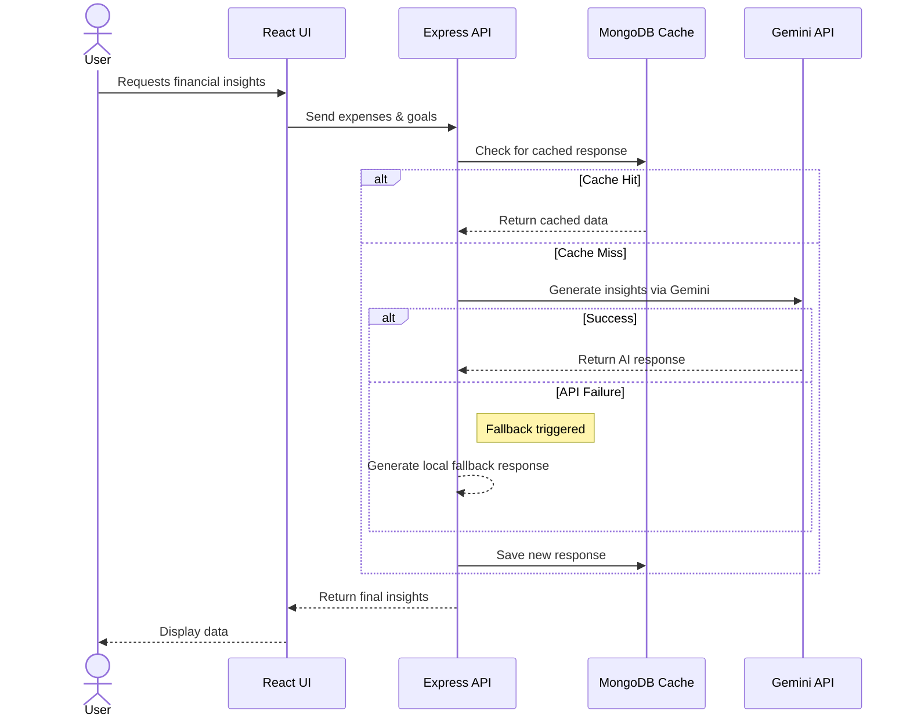

<div align="center">
  <h1>🔥 Rupee Roast</h1>
  <p><strong>AI-Powered Personal Finance Platform</strong></p>
  
  <p><em>Where smart budgeting meets AI-generated financial reality checks.</em></p>
  <br />
</div>

## 📖 Overview

**Rupee Roast** is a full-stack personal finance management application that goes beyond traditional budgeting. It combines robust expense tracking, goal setting, and insightful analytics with an integrated **AI Financial Assistant**. Powered by Google's Gemini AI, the app analyzes user spending habits to deliver personalized financial insights, practical suggestions, and humorous "roasts" based on user-selected modes (e.g., chill, aggressive).

Built with engineering maturity in mind, the platform features a responsive React frontend, a secure Node.js REST API, and a highly optimized MongoDB database layer.

---

## ⚡ Core Capabilities

### 🤖 AI Financial Assistant
- **Context-Aware Insights:** Analyzes current month spending, categorized expenses, and savings goals to generate personalized financial advice.
- **Dynamic "Roast" Engine:** Offers customizable interaction modes using the Gemini AI API.
- **Resilient AI Pipeline:** Features caching and local fallback systems to ensure 100% uptime.

### 💰 Expense Management
- **Transaction Tracking:** Full CRUD operations for expenses with categorization.
- **Behavioral Tagging:** Classifies spending as *necessary* or *impulsive* to drive better financial habits.

### 📊 Analytics & Dashboard
- **Financial Overview:** A comprehensive dashboard displaying quick statistics, recent activity, and a custom financial health score.
- **Data Visualization:** Interactive charts built with Recharts to visualize income vs. expenses, category distributions, and monthly trends.

### 🎯 Goals & Savings
- **Target Tracking:** Set, monitor, and update savings goals with deadline calculations and progress tracking.

### 🔒 Authentication & Security
- **Secure Access:** JWT-based stateless authentication and authorization for protected API routes.
- **Data Protection:** Passwords securely hashed via `bcryptjs`.
- **API Security:** Rate limiting implemented on the backend to prevent abuse.

---

## 🏗 Architecture & Tech Stack

- **Frontend:** React 19, Tailwind CSS, Recharts
- **Backend:** Node.js, Express.js
- **Database:** MongoDB (Mongoose)
- **AI Integration:** Google Gemini API (`@google/generative-ai`)

---

## 🧠 The AI Pipeline

The application features a streamlined AI integration designed for performance and reliability. It uses a caching layer to avoid redundant API calls and a fallback mechanism to ensure users always receive a response.

### High-Level Request Flow



---

## ⚡ Performance Benchmarks & Quality Scores

All metrics were empirically measured across 5 runs using runnable scripts in [`/benchmarks`](./benchmarks).

### AI Cache Efficiency (30 requests across 10 unique inputs × 3 repeats)
- **External Calls Saved:** **53.33%** (14 calls made vs 30 requests; 16 cached responses).
- **Latency Reduction:** **91.81%** (from 705.19 ms miss down to 57.68 ms index hit).
- **Cache Hit Latency:** **57.68 ms** average (direct compound index `{ userId, expenseHash }`).

### Lighthouse Audit Scores (5 Runs on Vite Production Preview)
| Metric | Score | Status |
| :--- | :--- | :--- |
| **Best Practices** | **100 / 100** | 🟢 Perfect score |
| **Accessibility** | **83 / 100** | 🟢 High accessibility standards |
| **SEO** | **82 / 100** | 🟢 Fully discoverable metadata |
| **Performance** | **71.8 / 100** | 🟡 Solid SPA client performance |

---

## 🚀 Getting Started

Follow these steps to run Rupee Roast locally on your machine.

### Prerequisites
- Node.js (v18+ recommended)
- MongoDB (Local instance or MongoDB Atlas URI)
- Google Gemini API Key

### 1. Clone the Repository
```bash
git clone <repository-url>
cd rupee-roast
```

### 2. Setup the Backend
```bash
cd server
npm install

# Create environment variables
cp .env.example .env
```
Ensure your `server/.env` includes:
```env
PORT=5000
MONGO_URI=your_mongodb_connection_string
JWT_SECRET=your_jwt_secret
GEMINI_API_KEY=your_gemini_api_key
```

### 3. Setup the Frontend
```bash
cd ../client
npm install

# Create environment variables
cp .env.example .env
```

### 4. Run the Application
Open two terminal windows:

**Terminal 1 (Backend):**
```bash
cd server
npm run dev
```

**Terminal 2 (Frontend):**
```bash
cd client
npm run dev
```
The client will typically start on `http://localhost:5173` and the server on `http://localhost:5000`.

---

<div align="center">
  <i>Engineered with clean architecture, performance optimizations, and a touch of humor.</i>
</div>
